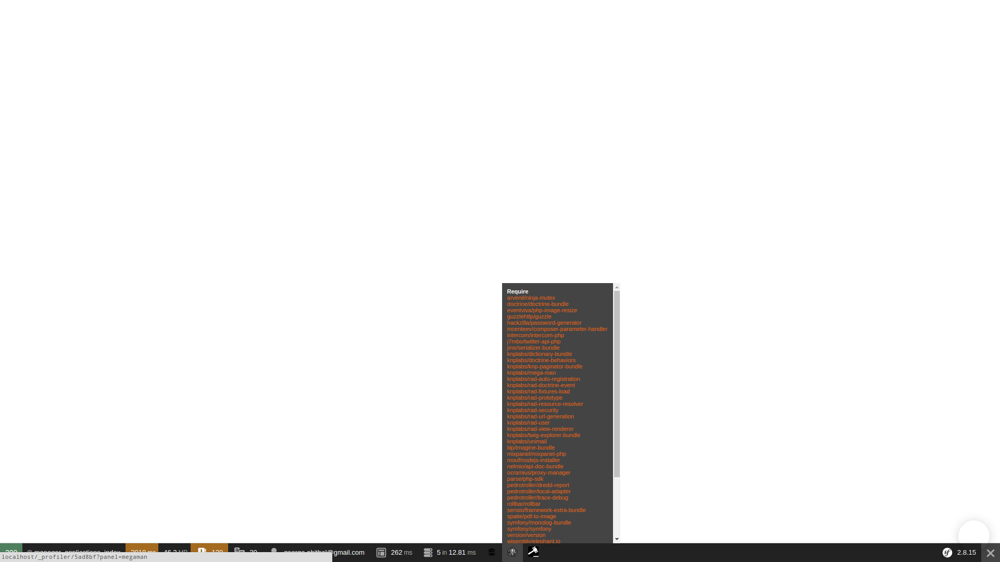
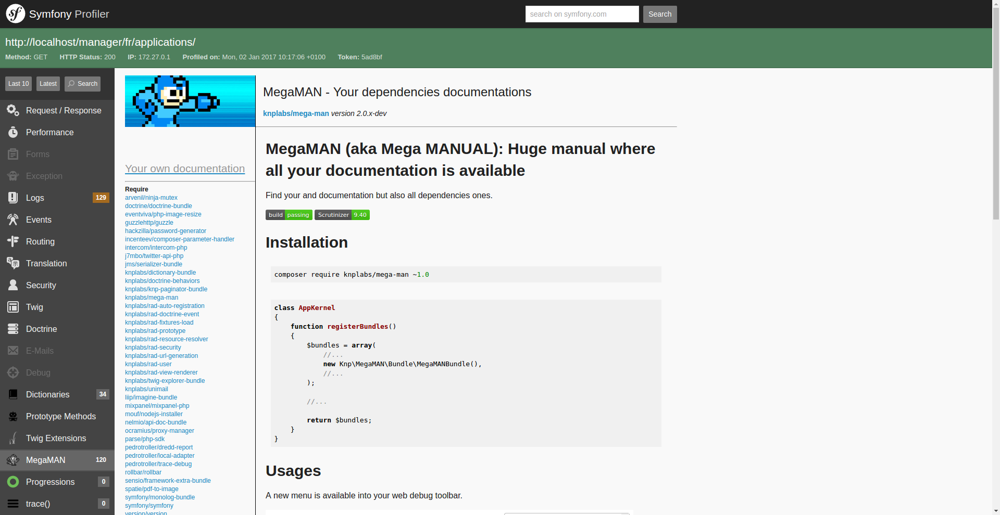

MegaMAN (aka Mega MANUAL): Huge manual where all your documentation is available
================================================================================
Find your and documentation but also all dependencies ones.

[](https://travis-ci.org/KnpLabs/MegaMAN)
[](https://scrutinizer-ci.com/g/KnpLabs/MegaMAN/?branch=master)

#Installation

```bash
composer require knplabs/mega-man ~2.0
```

```php
class AppKernel
{
    function registerBundles()
    {
        $bundles = array(
            //...
            new Knp\MegaMAN\Bundle\MegaMANBundle(),
            //...
        );

        //...

        return $bundles;
    }
}
```

#Usages

A new menu is available into your web debug toolbar.



Now you can access to all documentations.



 - YOUR OWN DOCUMENTATION => Your project documentation (if there is one)
 - Require => Your required dependencies
 - Require Dev => Your development required dependencies
 - Others => Other dependencies, dependencies of your dependencies
